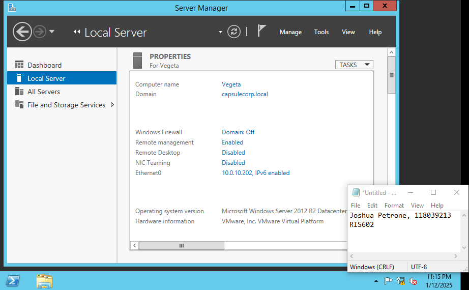

# Untitled

# Executive Summary

In preparation for this course, we are asked to deploy a following Virtual Pentest Lab. Particularly that follows the book “The Art of Network Penetration Testing”. It overall is going to replicate a realistic environment for pen testing to practicing vulnerability analysis. As well this prelab consists of many different services and operating systems which can provides a great hands-on experience overall. In this report I will show you the following configuration and ensure everything is working correctly.

# Scope

Now this lab includes a ton of different operating systems and VMs overall. Including 11 different VMs ranging from windows to Linux based OS’s. I have a main domain controller VM called “Goku” and other VMs connected to the domain controller. As you can see in the table below it specifies its ip ranges and OS in use.

Environment and Operating Systems

# Goku Virtual Machine (Domain Controller)

This is the heart of this environment setup, the Goku VM acts as the domain controller. I set this up first and followed the book using capsulecorp.local for the set up as followed.

pinging goku.capsulecorp.local

Goku Domain Controller

Computers in the Domain Controller

# Gohan Virtual Machine

This is the Gohan machine, as you can see in the figures below it follows proper configuration of IP and pinging works ensuring domain process is correct so far.

Pinging goku.capsulecorp.local from Gohan

Gohan Machine

IP Configuration Setup

# Vegeta Virtual Machine

Now the Vegeta machine is configured accordingly with ip being 10.0.10.202 and ping of domain controller works fine

Pinging goku.capsulecorp.local from Vegeta

Vegeta Machine

Vegeta Configuration Setup

# Trunks Virtual Machine

The trunks setup is joined to the domain controller. As you can see the IP configuration is correct with it being 10.0.10.203 static ip. Ping ensures the domain name, and such is configured correctly

Pinging goku.capsulecorp.local from Trunks

Trunks Machine

IP Configuration

# Raditz Virtual Machine

Looking at the raditz virtual machine, it has an IP of 10.0.10.207 and the domain is correct as you can see I can ping the domain controller machine.

Pinging goku.capsulecorp.local from Raditz

Raditz Machine

IP Configuration

# Nappa Virtual Machine

Pinging goku.capsulecorp.local from Nappa

IP Configuration

# Krillin Virtual Machine

Pinging goku.capsulecorp.local from Krillin

Krillin Machine

IP Configuration

# Yamcha Virtual Machine

Pinging goku.capsulecorp.local from Yamcha

Yamcha Machine

IP configuration

# Tien Virtual Machine

Pinging goku.capsulecorp.local from Tien

Tien Machine

IP Configuration

# Piccolo/Nail Virtual Machine (Same Process)

The following ubuntu machines the set up for connecting to the domain controller was a learning opportunity and used realm to do so. As well you can see the Netplan configuration is correct.

Domain Setup on Linux

IP Configuration and Netplan